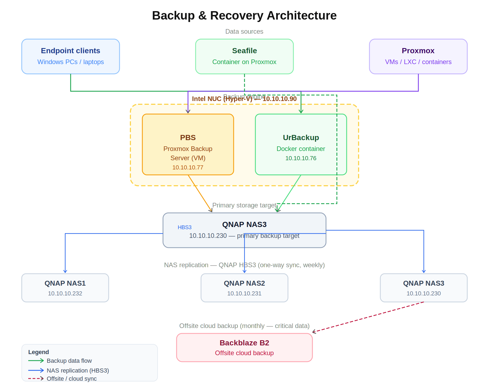

# 🧠 Backup & Recovery Architecture

## 🖼 Architecture Diagram



---

## 📌 Overview

A multi-layer backup strategy covering endpoints, virtualization, and file sync across a homelab environment. Designed around a dedicated backup engine (Intel NUC running Hyper-V) that is fully separate from the Proxmox virtualization host — ensuring backup infrastructure is not a single point of failure.

- Local backup → NAS replication → offsite cloud
- Backup engine isolated from primary compute (Proxmox)
- Separation of workloads across dedicated storage targets

---

## 🧱 Backup Layers

### Endpoint Backups
- **UrBackup** (Docker container on Intel NUC) → QNAP NAS3 (`10.10.10.230`)
- **Seafile** (container on Proxmox) → QNAP NAS3
  - Syncs Desktop and Documents from Windows PCs and laptops

### Virtualization Backups
- **Proxmox** → **PBS** (VM on Intel NUC, `10.10.10.77`) → QNAP NAS3
- Daily snapshots covering all VMs, LXC containers, and Docker volumes

### NAS Replication
- QNAP **HBS3** one-way sync (weekly)
- NAS3 (`10.10.10.230`) → NAS1 (`10.10.10.232`)
- NAS3 (`10.10.10.230`) → NAS2 (`10.10.10.231`)
- Replicates: critical data, UrBackup store, and NetBackup Replicator exports

### Offsite Backup
- **Backblaze B2** — monthly push of critical data only

---

## 🧱 Infrastructure

| Component | Role | Host | IP |
|---|---|---|---|
| Intel NUC (ASUSTeK) | Backup engine host | Hyper-V | `10.10.10.90` |
| Proxmox Backup Server | VM snapshot backup | Hyper-V VM on NUC | `10.10.10.77` |
| UrBackup | Endpoint file backup | Docker on NUC | `10.10.10.76` |
| Seafile | File sync / client backup | Container on Proxmox | — |
| QNAP NAS3 | Primary backup target | — | `10.10.10.230` |
| QNAP NAS2 | Replication target | — | `10.10.10.231` |
| QNAP NAS1 | Replication target | — | `10.10.10.232` |
| Backblaze B2 | Offsite cloud backup | — | Cloud |

---

## 🔁 Backup Schedule

| Frequency | Job |
|---|---|
| Daily | PBS snapshots (VMs / LXC / Docker), UrBackup (endpoints) |
| Weekly | NAS-to-NAS HBS3 replication (NAS3 → NAS1, NAS3 → NAS2) |
| Monthly | Backblaze B2 offsite push (critical data only) |

---

## 🔄 Backup Flow Summary

```
Endpoint Clients
  └── UrBackup (NUC 10.10.10.76) ──────────────┐
                                                 ▼
Proxmox (VMs / LXC / Containers)               QNAP NAS3 (10.10.10.230)
  └── PBS (NUC 10.10.10.77) ───────────────────►│
                                                 │
Seafile (Proxmox container) ────────────────────►│
                                                 │
                                    ┌────────────┴────────────┐
                                    ▼                         ▼
                             QNAP NAS1                  QNAP NAS2
                            (10.10.10.232)             (10.10.10.231)
                                    │
                                    ▼
                              Backblaze B2
                           (monthly, critical)
```

---

## 💡 Design Notes

- The Intel NUC runs **Hyper-V** and hosts both PBS (VM) and UrBackup (Docker) — keeping backup infrastructure independent of Proxmox
- **NAS3 is the single primary target** for all backup jobs; NAS1 and NAS2 are downstream replication targets only
- **Seafile** provides continuous file sync for workstation data (Desktop, Documents) in addition to the scheduled UrBackup jobs
- **HBS3 replication is one-way** — NAS1 and NAS2 are read-only replicas of NAS3's critical data and backup stores
- Backblaze acts as a last-resort recovery tier for catastrophic on-prem loss
